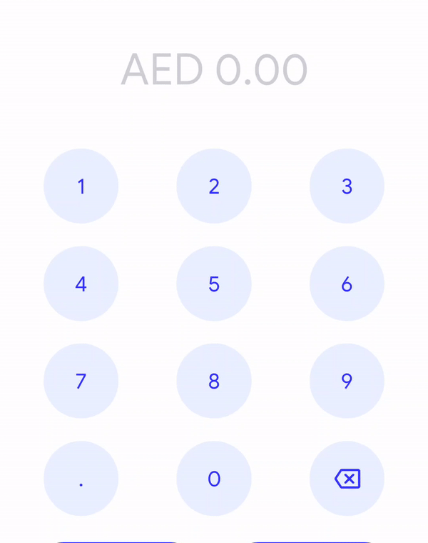
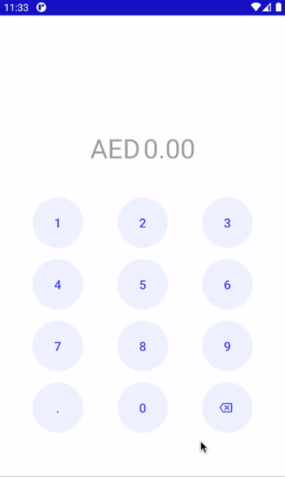

# mamo-test

## Video
|Requirement|Result|
|||


### Custom Widget
***Registering number and dot buttons to CurrencyWidget***
```kotlin
button.setOnClickListener {
        val value = button.text.toString()
        binding.currencyWidget.appendExpression(value)
    }
```

***Registering backspace to delete and/or clear the value***
```kotlin
keyboard.btnBackspace.apply {
setOnClickListener { currencyWidget.truncateExpression() }

    setOnLongClickListener {
        currencyWidget.clearExpression()
        true
    }
}
```

***Getting the final amount***
```kotlin
val moneyAmount = binding.currencyWidget.amount
```

### Added case
* Handle amount less than 1AED (e.g. 0.85 AED) when tap on either "0" or "." at first.
* Clear entire amount when long press on backspace button.

### Things to improve
* Ripple color is not exactly as in the Requirement Video
* Keyboard can be extracted to custom view for reusability 
* In-widget calculator functions can be integrated to Keyboard (user can easily doing calculator operation while inputting amount)


